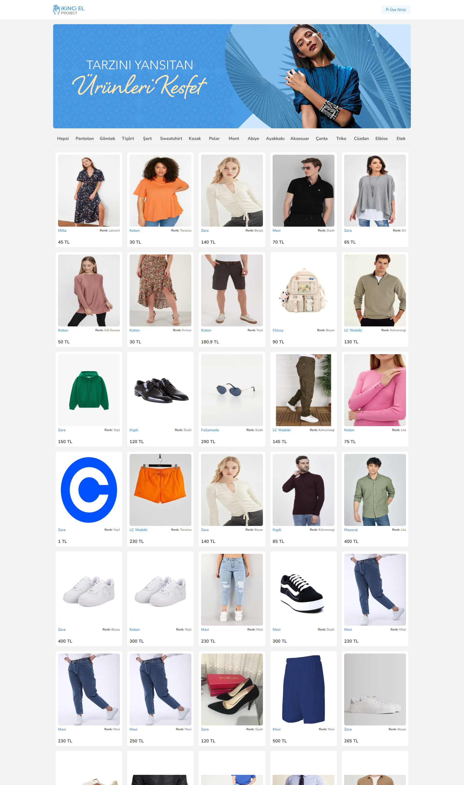
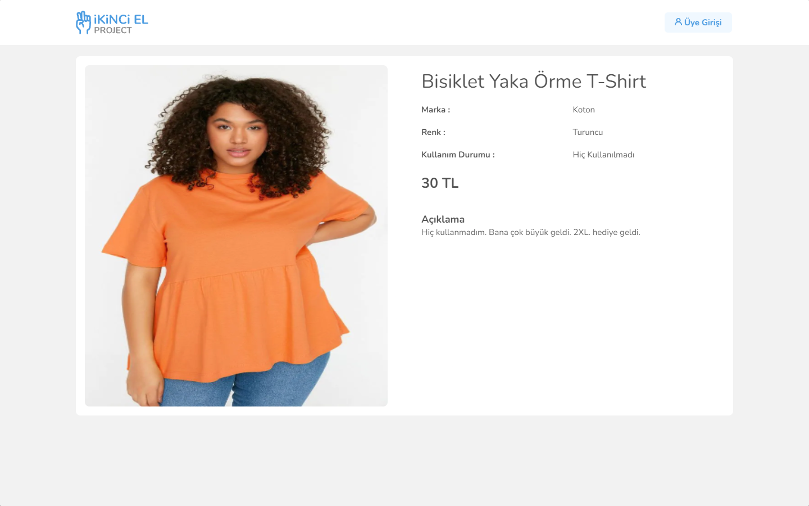
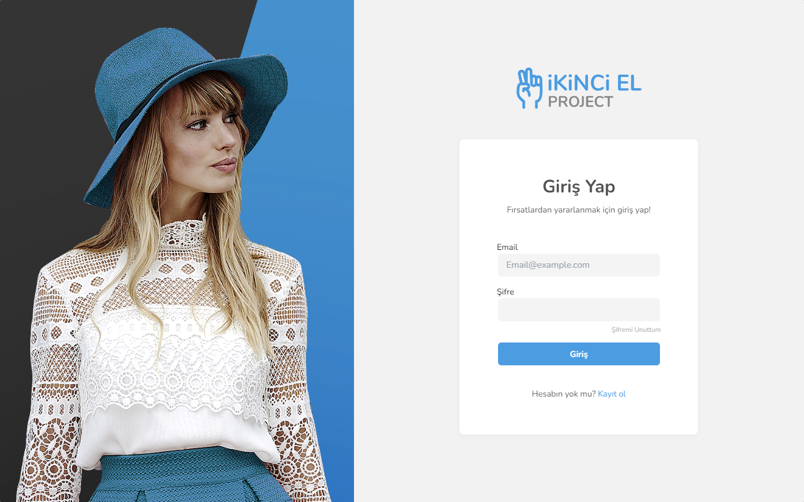
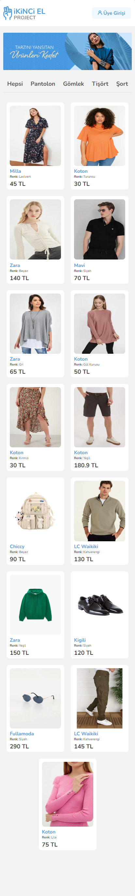
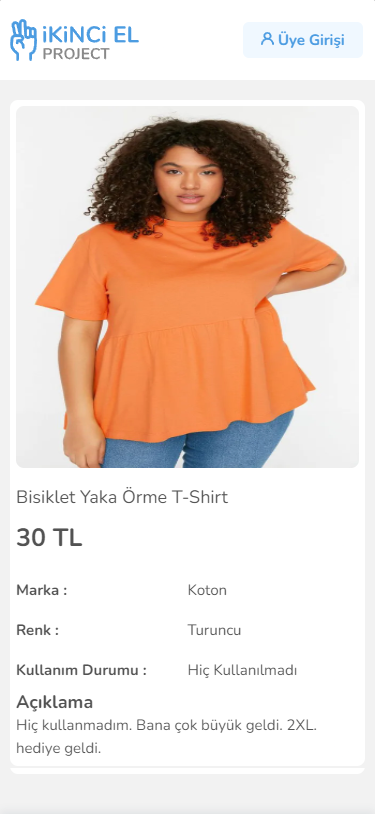
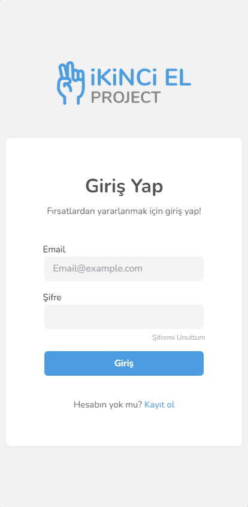

# İkinci El Project (Secondhand Project)

[](https://ikinci-el-batusan.vercel.app/)

Think an application where you can post secondhand items for sale and race with people for bids.

A SecondHand Project written in Nextjs

## Contents

- [Features](#features)
- [Technologies](#technologies)
- [Tests](#test)
- [Installation](#installation)
- [Structure](#structure)
- [Screenshots](#screenshots)
- [Issues](#issues)

## Features

- Register and login accounts. (validations)
- Search the system for categorized items.
- Add products.
- Bid products.
- Cancel bid.
- Buy products.
- Track product status.
- Track your offers (bids).

## Technologies

##### Frontend

- [Next.js](https://nextjs.org/ "Next.js")
- Formik - Yup
- [React-file-drop](https://www.npmjs.com/package/react-file-drop "React-file-drop") for image handling
- [js-cookie](https://www.npmjs.com/package/js-cookie "js-cookie") for handle easily cookies
- [Sharp](https://www.npmjs.com/package/sharp "Sharp") Image optimizer (Next.js suggestion)

##### Testing

- Jest
- react-testing-library

## Installation

For development :

```javascript
// Firstly install dependecies
npm install

//After we can run project , run dev gonna start on dev mode
npm run dev
```

For production:

```javascript
npm run build

//After we can run project , gonna start on production mode
npm start
```

Open http://localhost:3000 with your browser to see the result.

## Structure
    `/src/`  ->
        `@assets`  -> images and imported files.

        `@components`  -> a collection of UI components like buttons, modals, inputs, loader, etc.

        `@contexts`  -> React contexts

        `@hooks`  -> React Custom Hooks

        `@pages`  -> route of the application

        `@services`  -> shared services for SSR requests

        `@styles`  -> modules styles and global.css

## Screenshots

<details>
  <summary>Desktop View</summary>
  
  [](./readme-images/desktop-index.png "Main view")

[](./readme-images/desktop-detail.png "detail view")

[](./readme-images/desktop-login.png "login view")

</details>

<details>
  <summary>Mobile View</summary>
  
  [](./readme-images/mobile-index.png "Main view")

[](./readme-images/mobile-detail.png "detail view")

[](./readme-images/mobile-login.png "mobile view")

</details>

## Issues

- Images not displaying correctly on mid range resolutions
